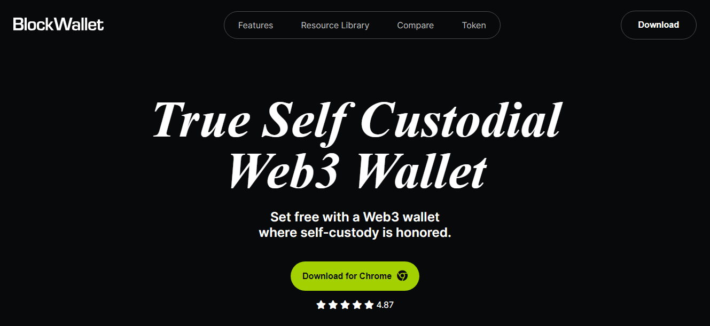

# BlockWallet A Web3 Wallet

A web3 wallet built with 4 pages.

## Table of contents

- [Overview](#overview)
  - [Features](#the-challenge)
  - [Screenshot](#screenshot)
  - [Links](#links)
- [My process](#my-process)
  - [Built with](#built-with)
- [Author](#author)

## Overview

BlockWallet is a true self custodial web3 wallet where you can easily manage token allowances to reduce the risk of losing funds to DApp hacks and exploits.

### The features of this project

The project has a total of about 4 pages with some functionalities.

- Home Page
- Blog Page
- Swap Page
- Docs

### Screenshots

### Links

- Live Site URL: [Deployed to Vercel](https://blockwallet-puce.vercel.app/)

## My process

### This project was built with

- Semantic HTML5 markup
- Mobile-first workflow
- CSS
- JavaScript

## Author

- [LinkedIn](https://www.linkedin.com/in/jeremiah-chinwe-057180268)
- Twitter - [@jeremiahchinwe](https://www.twitter.com/jeremiahchinwe)

